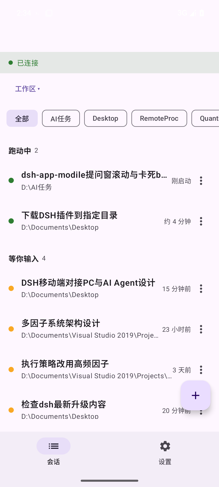
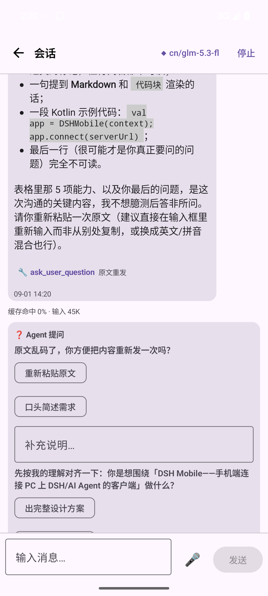
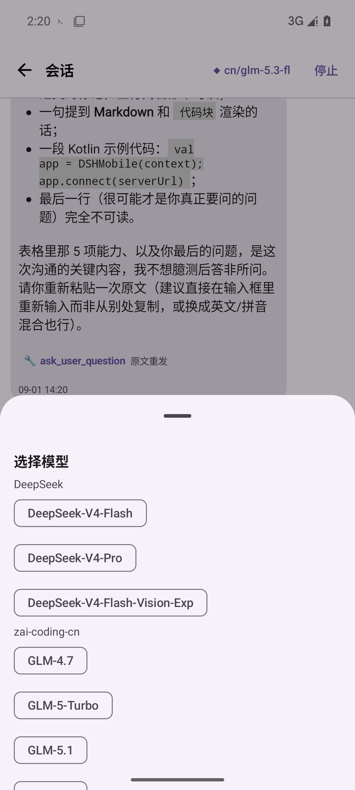
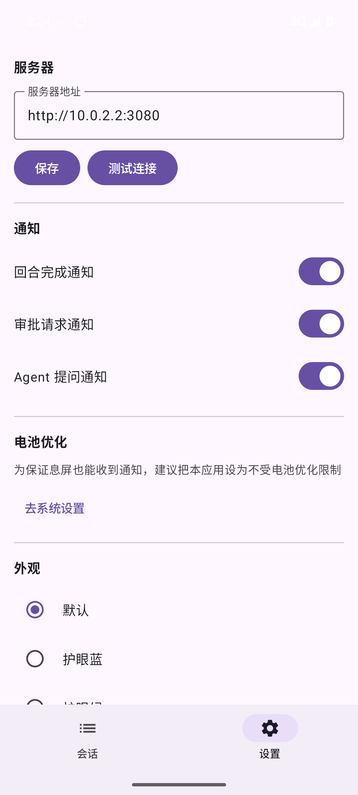

# DSH Mobile — 从零到用的完整部署指南

> **这是什么**：DSH Mobile 是一个安卓 App，让你用手机远程访问电脑上运行的 [DeepSeek Harness](https://github.com)（AI 对话工作台）。手机和电脑之间通过 Tailscale 加密隧道连接，不暴露公网。

| 会话列表 | 对话页 | 模型选择 | 设置 |
|:---:|:---:|:---:|:---:|
|  |  |  |  |

---

## 整体架构（1 分钟看懂）

```
你的手机（4G/5G/任何WiFi）
   │
   │  Tailscale 加密隧道（免费，类似VPN）
   ▼
你的电脑（家里/办公室）
   │
   │  Tailscale Serve 反向代理（自动HTTPS）
   ▼
DSH 工作台（运行在电脑的 127.0.0.1:3080）
```

**你需要准备**：
| 设备 | 要求 |
|---|---|
| 电脑（Windows） | 能上网，已安装 Node.js |
| 手机（Android） | Android 8.0 以上 |

---

## 第一步：电脑端安装 Tailscale（约 5 分钟）

### 1.1 下载安装

到 [tailscale.com/download](https://tailscale.com/download) 下载 Windows 版，双击安装。

或用命令安装：
```powershell
winget install Tailscale
```

### 1.2 注册并登录

1. 打开 Tailscale 客户端
2. 点击 **Log in**
3. 选择 **Sign up with email**（⚠️ 不要用 Google/Apple 登录，会创建独立网络导致手机连不上）
4. 输入你的邮箱，设置密码
5. 登录成功后，任务栏右下角会出现 Tailscale 图标

**验证**：打开命令行，执行：
```powershell
tailscale status
```
应该看到你的电脑名和 IP（类似 `100.x.x.x`）。

### 1.3 发布 DSH 到手机可访问的地址

执行以下命令，把电脑上的 DSH 端口发布为 HTTPS 域名：

```powershell
tailscale serve --bg --https=443 http://127.0.0.1:3080
```

**查看你的专属域名**：
```powershell
tailscale serve status
```
输出类似：
```
https://你的电脑名.你的网络名.ts.net (tailnet only)
|-- / proxy http://127.0.0.1:3080
```

**把 `https://` 后面的整段域名记下来**，后面要用（形如 `my-pc.tailabcd.ts.net`）。

---

## 第二步：电脑端启动 DSH（关键：必须带 --trusted-host）

> ⚠️ **这是最容易踩坑的一步**。DSH 有安全栏栅，只信任回环地址和显式指定的域名。
> 不带 `--trusted-host` 参数启动，手机 App 会收到 **403 Forbidden** 错误。

### 2.1 启动 DSH

```powershell
dsh web --host 127.0.0.1 --port 3080 --no-open --trusted-host 你的电脑名.你的网络名.ts.net
```

> 把 `你的电脑名.你的网络名.ts.net` 替换为第一步 1.3 中记下的域名。

### 2.2 验证启动成功

浏览器打开 `http://127.0.0.1:3080`，能看到 DSH 界面即成功。

再用命令验证手机通道：
```powershell
curl -s -o NUL -w "%{http_code}" https://你的电脑名.你的网络名.ts.net
```
输出 `200` = 手机可以访问 ✅
输出 `403` = 忘了带 `--trusted-host` ❌

<details>
<summary>📋 开机自启配置（推荐，一次配好）</summary>

创建 `C:\Users\你的用户名\AppData\Roaming\Microsoft\Windows\Start Menu\Programs\Startup\DSH-AutoStart.bat`：

```bat
@echo off
chcp 65001 >nul
rem 检查 Tailscale
sc query Tailscale | findstr "RUNNING" >nul 2>&1 || net start Tailscale
rem 恢复 serve
tailscale serve --bg --https=443 http://127.0.0.1:3080 2>nul
rem 启动 DSH（检查端口是否已有服务）
netstat -ano | findstr "127.0.0.1:3080" | findstr "LISTENING" >nul 2>&1
if errorlevel 1 (
    start /b cmd /c dsh web --host 127.0.0.1 --port 3080 --no-open --trusted-host 你的电脑名.你的网络名.ts.net
)
```

替换域名后保存。每次开机登录会自动就绪。
</details>

---

## 第三步：手机端安装（约 3 分钟）

### 3.1 安装 Tailscale App

1. 应用商店搜索 **Tailscale** 安装（或到 [tailscale.com/download](https://tailscale.com/download) 下载 APK）
2. 打开 → 登录 → **用和电脑相同的邮箱账号**
3. 顶部开关打开 → 允许 VPN 连接
4. 状态栏出现 **钥匙图标** = 已连接

> ⚠️ 手机和电脑**必须登录同一个 Tailscale 账号**，否则互相看不到。

### 3.2 安装 DSH Mobile App

1. 从 [Releases](../../releases) 下载最新 `DSH-Mobile-release-*.apk`
2. 传到手机（微信文件传输助手 / USB / 网盘均可）
3. 手机文件管理器点击 APK 安装（需允许"安装未知来源应用"）

### 3.3 首次启动（3 件事）

| 步骤 | 操作 | 为什么 |
|---|---|---|
| ① 允许通知 | 系统弹窗点"允许" | 否则收不到任何提醒 |
| ② 填服务器地址 | 设置 → 服务器地址 → 填第一步记下的域名 → 保存 | 告诉 App 连哪台电脑 |
| ③ 关电池优化 | 设置 → 电池优化 → 去系统设置 → 设为"不受限" | 否则安卓杀后台，息屏收不到通知 |

**验证**：首页顶部显示 **「已连接」** ✅

---

## 常见问题

### Q1：App 显示「不可达」

按顺序检查：
1. 手机 Tailscale 开了吗？（状态栏要有钥匙图标）
2. 手机能上网吗？
3. 电脑开机且 Tailscale 在跑吗？（电脑执行 `tailscale status` 看输出）
4. 电脑上 3080 端口有服务吗？（电脑执行 `netstat -ano | findstr ":3080"`）
5. `--trusted-host` 带了吗？（电脑浏览器打开 `https://你的域名` 看是否 200）

### Q2：连接正常但会话列表为空

正常现象：列表默认隐藏空白会话。在电脑上和某个会话对话后，下拉刷新 App 列表即可。

### Q3：换 Tailscale 账号后连不上了

每个 Tailscale 账号 = 独立的私有网络，换账号后域名会变：

1. 电脑：`tailscale serve status` 查看新域名
2. 电脑：用新域名重启 `dsh web --trusted-host 新域名`
3. 手机：Tailscale 登录新账号
4. 手机：App 设置页改服务器地址为新域名

### Q4：收不到通知

1. 系统通知权限开了吗？（设置 → 应用 → DSH Mobile → 通知）
2. 电池优化加白了吗？（App 设置页 → 电池优化 → 去系统设置）
3. Tailscale 在线吗？
4. App 设置里的三类通知开关开了吗？

### Q5：语音输入不可用

部分国产手机无谷歌语音服务。App 会自动降级到系统"识别活动"通道（由手机厂商/讯飞等接管）。如果仍不行，用输入法自带的麦克风语音输入。

### Q6：每次装新版要卸载吗？

同签名（release→release）直接覆盖装。不同签名（debug↔release）必须先卸载。

---

## 构建（开发者）

### 前置工具

JDK 17、Android SDK、Gradle 8.9。可用 `tools/setup_build_env.ps1` 一键安装到 `.toolchain/`。

> ⚠️ 必须从 ASCII 路径构建。项目路径含中文时，用 ASCII 联接目录（如 `D:\dshm` → 指向项目），`android.overridePathCheck=true` 已配置。

### 命令

```powershell
$env:JAVA_HOME="D:\dshm\.toolchain\jdk17"
$env:ANDROID_HOME="D:\dshm\.toolchain\android-sdk"
& "D:\dshm\.toolchain\gradle-8.9\bin\gradle.bat" -p "D:\dshm" --no-daemon assembleRelease
```

产物：`app\build\outputs\apk\release\DSH-Mobile-release-v<版本>.apk`

### 单元测试

```powershell
& "D:\dshm\.toolchain\gradle-8.9\bin\gradle.bat" -p "D:\dshm" --no-daemon testDebugUnitTest
```

当前 90/90 绿。

---

## 技术栈

| 层 | 选型 |
|---|---|
| 语言 | Kotlin 2.0.20 |
| UI | Jetpack Compose（BOM 2024.09.03，Material3） |
| 网络 | OkHttp 4.12.0（REST + WebSocket 双通道） |
| 序列化 | kotlinx-serialization-json 1.7.3 |
| 存储 | DataStore Preferences 1.1.1 |
| Markdown | jeziellago/compose-markdown 0.7.2（图片/代码块；表格暂不支持） |
| 构建 | Gradle 8.9 / AGP 8.6.1 |
| SDK | minSdk 26 / targetSdk 35 |
| 单测 | Kotlin test + MockWebServer |

---

## 相关文档

- [USAGE.md](USAGE.md) — 完整功能使用说明
- [docs/DESIGN.md](docs/DESIGN.md) — 技术设计文档
- [PROGRESS.md](PROGRESS.md) — 开发进度台账

## 许可证

[MIT](LICENSE)
